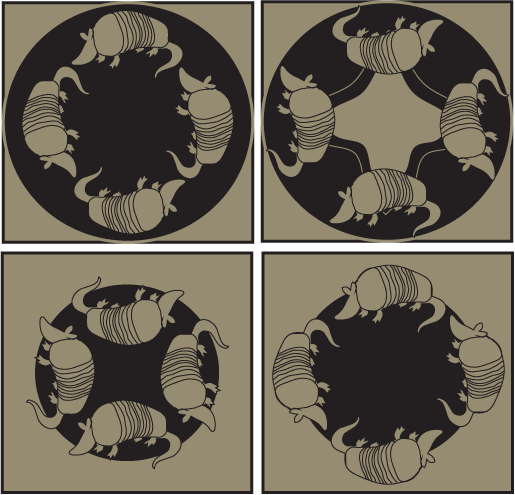

# ayotochtli

Armadillo comes from the Spanish meaning "little armoured one". 
The Aztecs called them "āyōtōchtli", Nahuatl for "turtle-rabbit". 

 

# The nine-banded armadillo 
This is the github repository for the armadillo project. 
Please find our preprint here: https://www.biorxiv.org/content/10.1101/2019.12.11.873265v1

