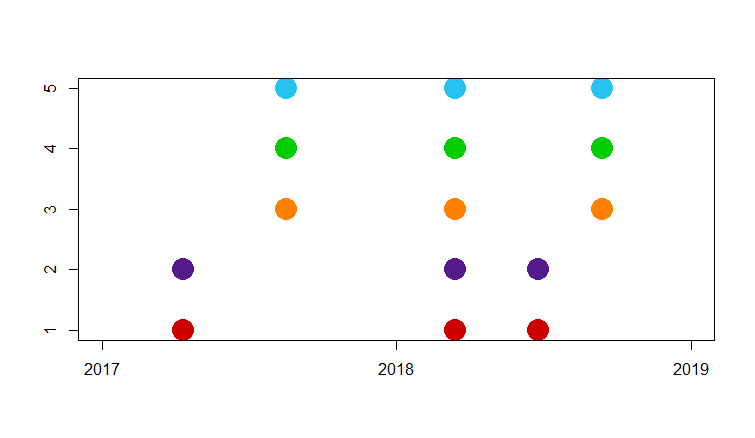
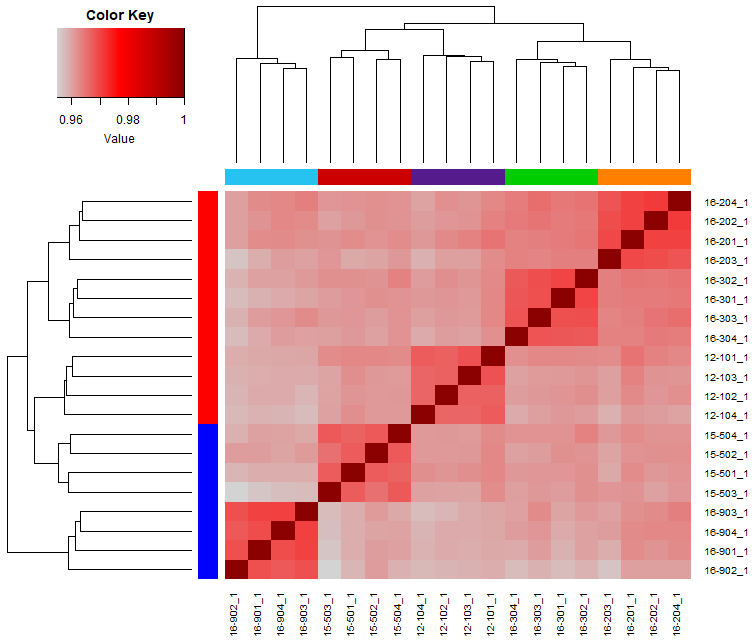
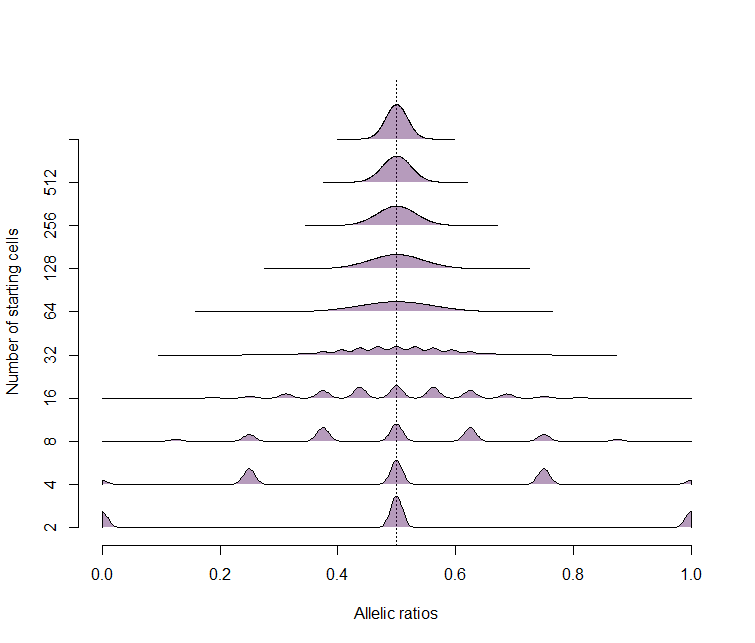

# Figure 1 

All data has been preprocessed and dumped into the data file. To run the analyses, please see the other notebooks referenced througout.  

Load helper functions and data.
 ```{r}
source("armadillo_helper.r")
source("load_data.r")
```


### Panel C 
Plot the collection timepoints for the five quadruplets. 
```{r} 
plot(lubridate::dmy( timepoints$Received), timepoints$Quad , xlim=c(17167,17897),  xlab="", ylab="", pch=19, col= candy_colors[as.numeric(timepoints$Quad)], cex=3)
```



### Panel D 
For all the timepoints, we use the CPM transformed RNA-seq expression data to calculate the sample similarity.  
For the analyses on generating this data, see the RNA-seq [notebook](rna_seq_data_processing.md).
```{r}
### Calculate sample-sample correlations 
sample.cors = cor(X.cpm.all, method ="spearman", use="pair")
```

Then plot the first timepoint. `r_samp`  has been defined in the `armadillo_helper.r` script. 

```
### Plot heatmap of first timepoint 
heatmap.3(sample.cors[r_samp,r_samp], 
          col=cols5, 
          ColSideCol = candy_colors[pData$Quad[r_samp]],
          RowSideCol = sex_colors[pData$Sex[r_samp]])
```

```
## Repeated plot with different column labels
hm = heatmap.3(sample.cors[r_samp,r_samp], 
               col=cols5, 
               ColSideCol = candy_colors[pData$Quad[r_samp]],
               RowSideCol =  (candy_colors)[-(1:3)][pData$Lanes[r_samp]])
```


### Panel F
The model for allelic ratios based on starting number of cells is the binomial model Binom(n,p), with the probability of either allele at 0.5.  
```
### Generate underlying data, selecting an allele based on number of starting cells  
raw_data = lapply( 2^(1:10), function(i) rbinom(1e5, i, 0.5)/i )
names(raw_data) = 1:10
### Plot distributions for starting cell numbers 
beanplot( raw_data, side="s", what = c(1,1,0,0), col=makeTransparent(viridis(10)), horizontal = T, bw = 0.01, cutmin = 0, cutmax = 1, frame.plot = F, boxwex = 2, axes=F, xlab="Allelic ratios", ylab="Number of starting cells"); axis(1); axis(2, at=1:10, labels= 2^(1:10))
```



