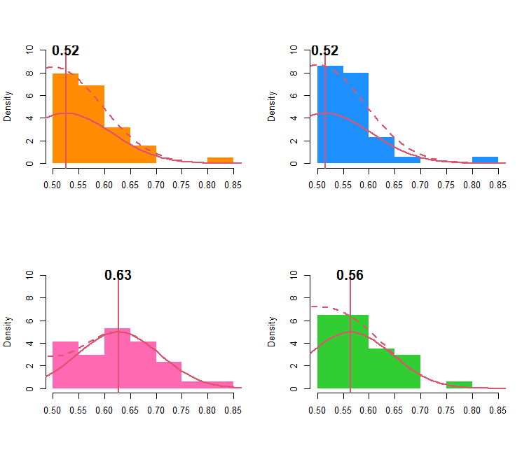
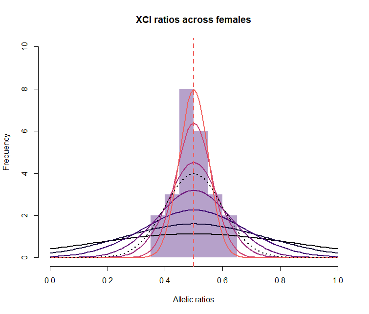
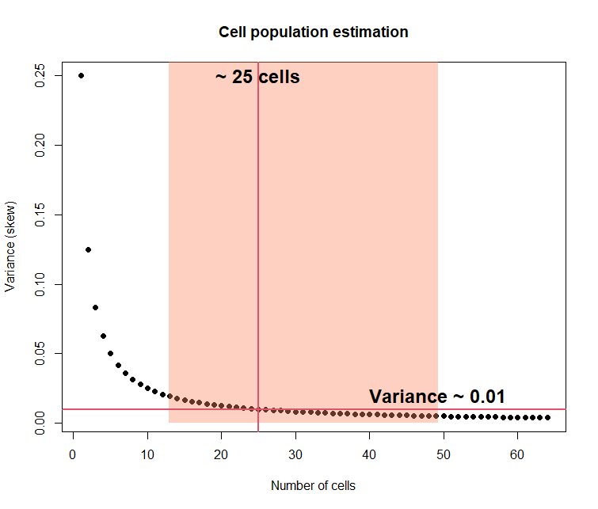
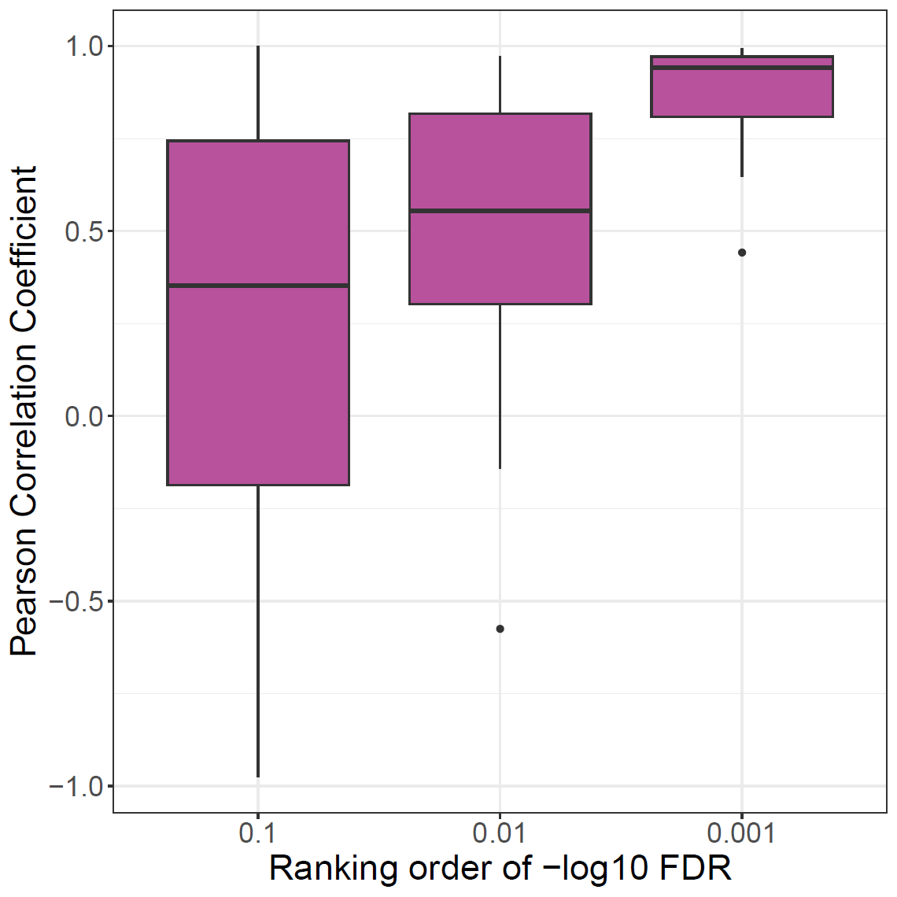
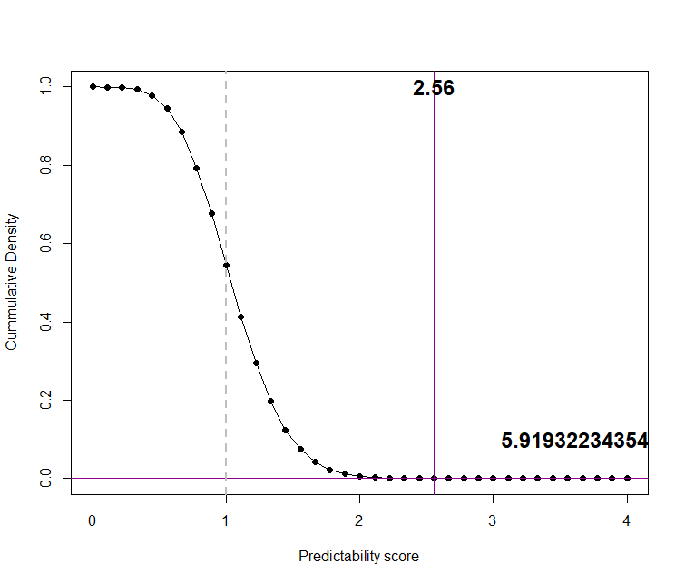
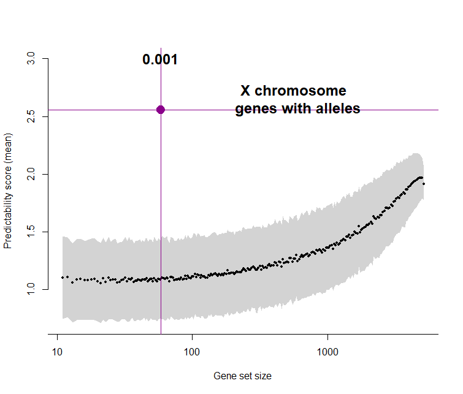

# Figure 2 
```
source("armadillo_helper.r")
source("load_fig2_data.r")
```

## Panel A

```
par(mfrow=c(2,2))
j = 2  ## Plot Quad 2 
p = 0:100/100 
### For each in individual within quad
for(i in 1:4){
  x = folded.x.list[[j]][[i]]
  hist(x, col=tropical_colors[i], border=NA, ylim=c(0,10), xlim=c(0.5,0.85), freq=FALSE , xlab="", main="")
  mu = as.numeric(fittfold.comb.list[[j]][[i]][1])
  sdu = as.numeric(fittfold.comb.list[[j]][[i]][2])
  lines( p, dnorm(p, mean = mu  , sd =  sdu ) , lwd=2, col=2, lty=1 )  
  abline(v=mu,lwd=2,col=2)
  text( mu, 10.1, round(mu,2), cex = 1.5, font=2 )
  lines(p, ((dnorm(p, mean = mu , sd = sdu ) + dnorm(p, mean = 1-mu, sd = sdu ))) ,lty=2, lwd=2, col=2)
}
```

 

## Panel B
```
# XCI ratios across females
ncells = c(2^(1:6), 100)
sd = 0.1
est = 0.5
N = 64 
pi = 0.5
var_est = (pi * (1-pi)) / (1:N)
var = (sd)^2
nn = (pi * (1-pi))/var


hist( unfold(est_fold_means), main="XCI ratios across females", xlab="Allelic ratios",   col=makeTransparent(magma(10)[3]), border=NA, xlim=c(0,1), ylim=c(0,10))
for(i in 1:7 ) { 
  lines( sort(unfold(p)), dnorm(sort(unfold(p)), mean = 0.5 , sd = sqrt(0.25/ncells[i]) ), lwd=2, col=magma(10)[i] ) 
}
lines( sort(unfold(p)), dnorm(sort(unfold(p)), mean = 0.5 , sd = sd ) , lwd=2, col=magma(10)[1], lty=3 )  
abline(v=est, col=magma(10)[7],lwd=2, lty=2) 
```
 

``` 
## Cell population estimation
est_from = tail(sort(array(est_fold_means)), n=3)
myBootstrap3 <- boot( est_from, foo  , R=1000 )
bootCI3 = boot.ci(myBootstrap3, index=1)


plot(  (1:N), (var_est), pch=19, xlab="Number of cells", ylab="Variance (skew)", main="Cell population estimation")
polygon(  ( c(bootCI3$percent[4],bootCI3$percent[5],bootCI3$percent[5],bootCI3$percent[4])), 
          c(0,0,1,1),
          col=makeTransparent(magma(5)[4]),
          border=NA)
abline(h=var, col=2, lwd=2)
abline(v= (nn), col=2,lwd=2)
text( nn, .25, paste("~", nn, "cells"), cex = 1.5, font=2 ) 
text( bootCI3$percent[5], var+0.01, paste("Variance ~", var) , cex = 1.5, font=2 )


n_cells_var = cbind((1:N), (var_est))
ci_range = cbind( c("variance", "ncells", "ci_boot1", "ci_boot2"), c(var,nn,bootCI3$percent[4],bootCI3$percent[5])) 
```
 


## Panel D 
_Note, same plot as in fig3E_
```
colors[['X']] <- rgb(184/255, 82/255, 157/255)

tdf = readRDS("qrank_data___all_emp_p_adj_cor.rds")
label = c('1'='0.1', '2'='0.01', '3'='0.001')
ylab = "Pearson Correlation Coefficient"
xlab = "Ranking order of -log10 FDR"

ggplot(subset(tdf[tdf[,'SNP'] == 'X',])) + geom_boxplot(aes(value, cor), fill=colors[['X']])+theme_bw()+theme(text=element_text(size=20))+
    xlab(xlab)+ylab(ylab) + scale_x_discrete(labels=label)
```



## Panel E 
```
#pred_score = get_score
pval_score = pval.sum2[match(mean(pred_score ), pval.sum2 [,1]),2]
 
plot( pval.sum2, pch=19, xlab="Predictability score", ylab="Cummulative Density", type="o")
abline(v=pred_score, col="darkmagenta")
abline(h=pval_score, col="darkmagenta")
text( pred_score, 1, round(pred_score,2), cex = 1.5, font=2 ) 
text( pred_score +0.5, 0.1, pval_score, round(pval_score,1), cex = 1.5, font=2 ) 
abline(v=1, col="grey", lty=2,lwd=2)
```
 


## Panel F 
```
cr = sapply(1:length(nr3), function(i) mean(rand.q3[[i]] ) )
cr.sd = sapply(1:length(nr3), function(i) sd(rand.q3[[i]] ) )
cr.se = sapply(1:length(nr3), function(i) se(rand.q3[[i]] ) )

Y_c = cr[-1]
X_c = log10(nr3)[-1]
std_Y_c = cr.sd[-1] 
ymax =  3 
ymin  = min( Y_c - std_Y_c)
ylab = "Predictability score (mean)"
xlab = "Gene set size"

plot( X_c, Y_c, ylim = c(ymin, ymax),  lwd = 4, type = "l", col = 0, bty = "n", xlab = xlab, ylab = ylab,  axes=F)
polygon(c(X_c, rev(X_c)), c(Y_c - std_Y_c, rev(Y_c + std_Y_c)), col = "lightgrey", border = NA)
points(X_c, Y_c, ylim = c(ymin, ymax) , pch=19, cex=0.5)
axis(2)
axis(1, at = (0:4), lab = 10^(0:4))


nxchr_genes = log10(mean(sapply(2:4, function(j) sum(!is.na(match(ratios.max.genes[[j]][,4], scaffoldsX.prop3))))))
pval_nxchr = (1+sum( pred_score<= rand.q3[[which( log10(nr3)   >= nxchr_genes  )[1]]]))/length(rand.q3[[1]])  
abline(h=pred_score, col="darkmagenta")
abline(v=nxchr_genes, col="darkmagenta")
text(nxchr_genes,3, pval_nxchr, cex = 1.5, font=2 ) 
points(nxchr_genes,pred_score,  pch=19,cex=2,col="darkmagenta")
text(nxchr_genes+1, pred_score+0.1,  "X chromosome \n genes with alleles",  cex=1.5, font=2)
```
 


