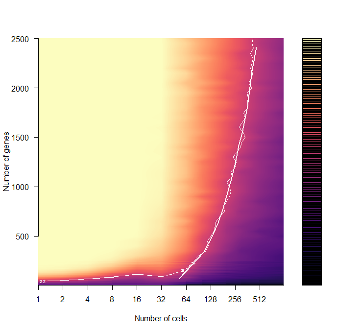

# Figure 3 
```
source("armadillo_helper.r")
source("load_fig3_data.r")
```

## Panel A
```
max_cell = 1e4
cnum = as.numeric(rownames(m))
ncov = as.numeric(colnames(m))
cov_quantile <- c(1.051153, 1.295567, 1.625827, 1.977724, 2.202761)
cov_vec <- ceiling(10**(cov_quantile))


x =   log2(cnum)
y =  (ncov)
xa = sort(rep(x, length(y)))
ya = rep(y, length(x))
ya[is.na(ya)] = 0
za = array( t(m ) ) 
temp2 = cbind(xa,ya,za)[!is.na(za),]
zi = interp(temp2[,1],temp2[,2], temp2[,3])

conts = c( 0.75,0.99,1) 
x = list()
yo = list() 
for(i in 1:length(conts) ) {
  cont = which(round(zi$z, 2) == conts[i], arr.ind=T)
  x[[i]] = zi$x[cont[,1]]
  y = zi$y[cont[,2]]
  o = order(x[[i]])
  x[[i]]= x[[i]][o]
  y = y[o]
  lo = loess(y~x[[i]])
  yo[[i]] = predict(lo)
}  


filled.contour( log2(cnum), (ncov), t(t(m)), 
                col= inferno(50), levels=(50:100)/100, axes=F,
                xlab="Number of cells",
                ylab="Coverage (read counts)", frame.plot=F,
                plot.axes = { 
                  axis(1, at=log2(cnum), lab=cnum ) ; 
                  axis(2, at=10*(1:20), lab=10*(1:20));
                  sapply(1:3, function(i) lines(x[[i]],yo[[i]], col=magma(5)[1], lwd=2)); 
                  abline(h = cov_vec, col="grey", lwd=1, lty=2); 
 
                }
) 
```


## Panel B  

```
plot(log2(cnum),log2(cnum), col=0, ylim=c(0.5,1), axes=F, ylab="AUROCs", xlab="Number of cells")
for( i in 1:5){ 
  lines( log2(cnum), part[,i], lwd=2 , col=magma(10)[i])       
  points( log2(cnum), part[,i] , pch=19, col=magma(10)[i])       
}
axis(2)
axis(1, at=log2(cnum), lab=cnum ) ; 
legend("topright", leg=cov_vec,  col = magma(10)[1:5], pch=19, lwd=2 )
```


## Panel C 
```
nq = quad_m[,1]  
quad_m = quad_m[,-1]  
ncov = as.numeric(colnames(quad_m))

rownames(quad_m) = nq 

filled.contour( (nq), (ncov), t(t(quad_m)), 
                col= inferno(50), levels=(50:100)/100, axes=F,
                xlab="Number of quads",
                ylab="Coverage (read counts)", frame.plot=F,
                plot.axes = { 
                  axis(1 ) ; 
                  axis(2 );
                  #sapply(1:3, function(i) lines(x[[i]],yo[[i]], col="white", lwd=2)); 
                  abline(v = 5, col="grey", lwd=1, lty=2); 
                  abline(h = cov_vec, col="grey", lwd=1, lty=2); 
                  
                  contour(  (nq),  ncov,   t( t(quad_m)), 
                            levels = c(0.75,0.99, 1 ), add=T, col=magma(10)[1]) ;    
                }
) 
```


## Panel D 

```
nq_vec = c(1,5,10,50,75,100)
part <- quad_m[rownames(quad_m) %in% nq_vec,] 


plot(ncov,log2(ncov), col=0, ylim=c(0.5,1), axes=F, ylab="AUROCs", xlab="Coverage", main="")
for( i in 1:length(nq_vec)){ 
  lines( ncov, part[i,], lwd=2 , col=magma(10)[i])       
  points( ncov, part[i,] , pch=19, col=magma(10)[i], cex=2)       
}
axis(2)
axis(1 ) ; 
legend("right", leg=nq_vec,  col = magma(10) , pch=19, lwd=2 )
```


## Panel E 
```
colors[['X']] <- rgb(184/255, 82/255, 157/255)
colors[['No X']] <- rgb(91/255, 89/255, 166/255)

tdf = read.csv("rank_data___all_emp_p_adj_cor.csv")
tdf[,'qrank'] <- cut(tdf[,'rank'], seq(0, 1, 0.2), labels=seq(0.2, 1.0, 0.2), include.lowest=TRUE)
label = c('0.2'='0.2', '0.4'='0.4', '0.6'='0.6', '0.8'='0.8', '1'='1.0')
tdf[,'fisher'] <- tdf[,'value']
tdf[,'value'] <- cut(tdf[,'value'], seq(0, 3, 1), labels=seq(1, 3, 1), include.lowest=TRUE)
label = c('1'='0.1', '2'='0.01', '3'='0.001')
ylab = "Pearson Correlation Coefficient"
xlab = "Ranking order of -log10 FDR"

ggplot(subset(tdf[tdf[,'SNP'] == 'X',])) + geom_boxplot(aes(value, cor), fill=colors[['X']])+theme_bw()+theme(text=element_text(size=20))+
    xlab(xlab)+ylab(ylab) + scale_x_discrete(labels=label)
ggplot(subset(tdf[tdf[,'SNP'] == 'No X',])) + geom_boxplot(aes(value, cor), fill=colors[['No X']])+theme_bw()+theme(text=element_text(size=20))+
    xlab(xlab)+ylab(ylab) + scale_x_discrete(labels=label)

wide_nox = read.table("cumsum___emp_p_adj_cor_No X.tsv")
wide_x = read.table("cumsum___emp_p_adj_cor_X.tsv")
ylab = "Cumulative ratio of deviated SNPs"
xlab = "Pearson Correlation Coefficient"

ggplot(wide_x, aes(x=crank, y=ratio)) + geom_point() + geom_smooth(method = "loess", se=FALSE, color=colors[['X']]) +
    theme_bw()+theme(text = element_text(size=20)) +  xlab(xlab)+ylab(ylab)
ggplot(wide_nox, aes(x=crank, y=ratio)) + geom_point() + geom_smooth(method = "loess", se=FALSE, color=colors[['No X']]) +
    theme_bw()+theme(text = element_text(size=20)) +  xlab(xlab)+ylab(ylab)

```


## Panel G 

```
pval_score = pval.sum[match(mean(pred_score ), pval.sum [,1]),2]

plot( pval.sum , pch=19, xlab="Predictability score", ylab="Cummulative Density", type="o")
abline(v=pred_score, col="darkmagenta")
abline(h=pval_score, col="darkmagenta")
text( pred_score, 1, round(pred_score,2), cex = 1.5, font=2 ) 
text( pred_score +0.5, 0.1, pval_score, round(pval_score,1), cex = 1.5, font=2 ) 
abline(v=1, col="grey", lty=2,lwd=2)
```


 
## Panel H
```
cr = sapply(1:length(rand.q), function(i) mean(rand.q[[i]] ) )
cr.sd = sapply(1:length(rand.q), function(i) sd(rand.q[[i]] ) )
cr.se = sapply(1:length(rand.q), function(i) se(rand.q[[i]] ) )
nr3 = nr3[1:length(rand.q)]

Y_c = cr[-1]
X_c = log10(nr3)[-1]
std_Y_c = cr.sd[-1] 
ymax =  3 
ymin  = min( Y_c - std_Y_c)
ylab = "Predictability score (mean)"
xlab = "Gene set size"

plot( X_c, Y_c, ylim = c(ymin, ymax),  lwd = 4, type = "l", col = 0, bty = "n", xlab = xlab, ylab = ylab,  axes=F)
polygon(c(X_c, rev(X_c)), c(Y_c - std_Y_c, rev(Y_c + std_Y_c)), col = "lightgrey", border = NA)
points(X_c, Y_c, ylim = c(ymin, ymax) , pch=19, cex=0.5)
axis(2)
axis(1, at = (0:4), lab = 10^(0:4))


nfeat_genes =  log10(mean(sapply(1:5, function(i) sapply(1:3, function(j) length(feature.genes[[i]][[j]])))))
pval_nfeat = (sum( pred_score<= rand.q[[which( log10(nr3) >= nfeat_genes  )[1]]]))/length(rand.q[[1]])  

abline(h=pred_score, col="darkmagenta")
abline(v=nfeat_genes, col="darkmagenta")
points(nfeat_genes,pred_score,  pch=19,cex=2,col="darkmagenta")
text(nfeat_genes-0.5, pred_score+0.1,  "Feature set",  cex=1.5, font=2)
text(nfeat_genes,3, pval_nfeat, cex = 1.5, font=2 ) 

max_ngenes = log10(max(nr3))
max_score = tail(cr,n=1)
abline(h=max_score, col="darkturquoise")
abline(v=max_ngenes, col="darkturquoise")
points(max_ngenes,max_score,  pch=19,cex=2,col="darkturquoise")
text(max_ngenes+1, max_score+0.1,  "All genes\n with allelic\variation",  cex=1.5, font=2)
```


 
## Panel I

```
Nmax = 5000 
x = ncells
y = fracs2*Nmax
xa = sort(rep(x, length(y)))
ya = rep(y, length(x))
ya[is.na(ya)] = 0
za = array( all.mat )
temp2 = cbind(xa,ya,za)[!is.na(za),]
zi = interp(temp2[,1],temp2[,2], temp2[,3])

conts = c(2.2) 
x = list()
yo = list() 
for(i in 1:length(conts) ) {
  cont = which(round(zi$z, 1) == conts[i], arr.ind=T)
  x[[i]] = zi$x[cont[,1]]
  y = zi$y[cont[,2]]
  o = order(x[[i]])
  x[[i]]= x[[i]][o]
  y = y[o]
  lo = loess(y~x[[i]])
  yo[[i]] = predict(lo)
}  

filled.contour( log2(ncells), fracs2*Nmax,  t( all.mat), col= magma(400), levels=(0:400)/100, axes=F, 
        xlab="Number of cells",
                ylab="Number of genes", frame.plot=F,
                plot.axes = { 
               # axis(1); axis(2);
                 axis(1, at=0:10, lab=2^(0:10)); axis(2);
                  sapply(1, function(i) lines( log2(x[[i]]),yo[[i]], col="white", lwd=2)); 
                contour(  log2(ncells), fracs2*Nmax,  t( all.mat), levels = c(2.2 ), add=T, col="white") ;   
                }) 
```


## Panel J
```
filt1 = (results.mat[,1] >= 20  & results.mat[,1] <= 1000)
filt1_sig = rowSums((results.mat[filt1,4:8]) >= 3 ) > 0 
temp = GO.voc[rownames(results.mat[filt1,][filt1_sig,]),]
heatmap.3( (results.mat[filt1,4:8][filt1_sig,]),Colv=F, col=magma(13), ColSideCol=candy_colors[1:5], labCol=quads)
```


